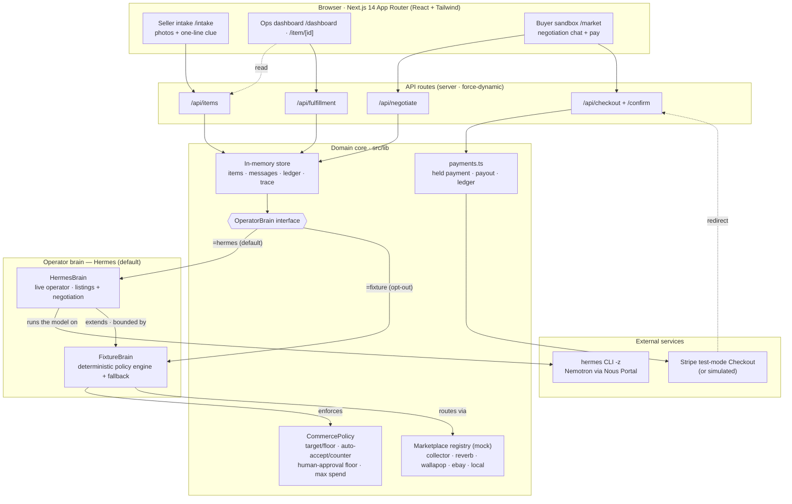
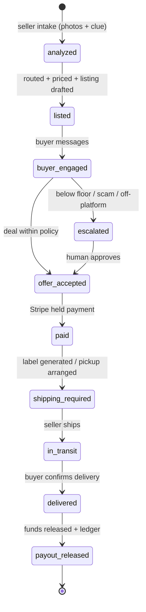

# CashFromChaos

> **I don’t want this. CashFromChaos sells it.**

Autonomous, policy-bound recommerce operator for the **Hermes Agent Accelerated
Business Hackathon** (Nous Research × NVIDIA × Stripe).

You send photos of a real object you no longer want and a one-line clue. Hermes
runs the whole operation: understands the item, asks only the critical
questions, routes it to the right marketplace, prices it, drafts listings,
negotiates with buyers under an explicit policy, collects a Stripe-held payment,
guides shipping/pickup, and releases payout on delivery.

> Point your camera at things you don’t want. Hermes sells them.

## Status — working demo (local-first)

This is a runnable Next.js app, not just planning docs. The full loop works
end-to-end — **Hermes operates it live**, on a deterministic policy engine that
keeps every take reliable for the demo video.

## Quick start

```bash
npm install
npm run dev          # http://localhost:3000
```

Build / checks:

```bash
npm run typecheck    # tsc --noEmit
npm run build        # production build
npm run start        # serve the production build
```

No environment variables are required — payments run in a fully **simulated
held-payment** mode out of the box. To use real Stripe test-mode Checkout, copy
`.env.example` to `.env.local` and set `STRIPE_SECRET_KEY` (sk_test_…). In test
mode pay with card `4242 4242 4242 4242`, any future expiry, any CVC. The
post-payment redirect returns to whatever host you opened the app from (handy
when serving to a phone over a LAN / Tailscale address, not just localhost).

**Mobile full-screen:** the app ships a web manifest, so on a phone you can use
Chrome/Safari → *Add to Home Screen* to launch it standalone, without the
browser address bar.

## What to click (demo path)

1. **/** — the hook. “Point your camera at things you don’t want.”
2. **/intake** — pick a demo photo + clue, answer the 1–3 critical questions,
   go live. (“Relax. I’ll handle it.”)
3. **/dashboard** — operations view: every item, channel, target/floor price,
   confidence, next action. `↺ Reset demo` re-seeds for a clean take.
4. **/item/[id]** — the operation in detail: Analysis · Marketplace · Listings ·
   Policy · Buyer · Payment · Fulfillment · P&L, plus a live decision trace.
5. **/market** — the **buyer sandbox**. Open a listing, haggle with Hermes
   (“Would you take €50?”), reach a deal, and pay with Stripe.
6. Back on **/item/[id] → Fulfillment**, mark shipped, then confirm delivery →
   funds released → net payout shown.

See [`DEMO_SCRIPT.md`](./DEMO_SCRIPT.md) for the scene-by-scene video script.

## How it’s built

- **Next.js 14 (App Router) + TypeScript + Tailwind.** No DB required; an
  in-memory store seeds three demo items (collectible / music / bulky-local).
- **Hermes is the operator** (`OperatorBrain`, `src/lib/types.ts`). The default
  brain is **`HermesBrain`** (`src/lib/operator/llmBrain.ts` → the local `hermes`
  CLI, `-z` single-shot; Nemotron via Nous Portal): it runs the live model that
  drafts the listings and negotiates with buyers. It is **built on** a
  deterministic **policy engine** (`FixtureBrain`, its base class) that holds
  every decision — price, accept/counter, routing, spend — inside the seller's
  `CommercePolicy`, and is the safe fallback if the CLI is ever unavailable.
  Selected via `OPERATOR_BRAIN` (**default `hermes`**); set
  `OPERATOR_BRAIN=fixture` to force pure-deterministic, fully-offline mode.
- **Marketplace-agnostic routing.** Adapters are interfaces with mock
  implementations (`src/lib/marketplace/registry.ts`): collector channel,
  music channel, generalist, global, local-pickup. Hermes picks by item.
- **Visible policy layer** (`CommercePolicy`): target/floor, auto-accept,
  auto-counter, human-approval floor, max fulfillment spend, allowed channels
  /payments, shipping vs pickup. Every brain must obey it — it can never accept
  below floor without human approval, overspend, or take off-platform payment.
- **Stripe-powered held payment** — escrow-like marketplace flow for demo
  purposes; funds release after delivery confirmation. Real test-mode Checkout
  when a key is present, otherwise simulated.

## Architecture

CashFromChaos is a single Next.js app — React/Tailwind UI, server API routes,
and a typed domain core. No database: an in-memory store seeds three demo items.
**Hermes is the operator** behind the `OperatorBrain` interface (with a
deterministic engine as its base class and offline fallback), and the
**`CommercePolicy` is the hard boundary it cannot cross.**



**Hermes operates; policy is the boundary.** `HermesBrain` is the operator the
buyer talks to. It *extends* a deterministic policy engine (`FixtureBrain`), so
every *decision* — category, price band, accept/counter/escalate, the agreed
number, fulfillment mode and max spend — is clamped to the seller's
`CommercePolicy`. That guardrail is exactly what lets an autonomous LLM run the
sale safely: Hermes can never push a price below floor, overspend, or take
off-platform payment, and if the CLI is ever unavailable the deterministic path
keeps the operation running.

### Transaction lifecycle

Every item moves through an explicit, observable state machine — the decision
trace and P&L are built from these transitions:



### Request flow (happy path)

1. **Intake** — `POST /api/items` → `store.createItemFromIntake` runs the brain
   pipeline `analyzeItem → chooseMarketplace → buildPolicy → draftListings`.
2. **Negotiate** — `POST /api/negotiate` → `handleBuyerMessage` (policy-bound
   decision + Hermes prose); a deal sets `offer-accepted`.
3. **Pay** — `POST /api/checkout` → `payments.ts` → Stripe Checkout (or
   simulated). Stripe redirects to `GET /api/checkout/confirm`, which holds the
   payment and runs `decideFulfillment`.
4. **Fulfil** — `POST /api/fulfillment` ship → deliver → payout released, ledger
   and net P&L finalised.

## Not in this MVP (by design)

Real marketplace automation, legal escrow, multi-user auth, whole-room
inventory scanning. The differentiator is **policy-bound autonomous commerce
over messy physical inventory**, demoed as a reliable, cinematic loop.

## Image credits

Demo item photos are Creative Commons, used as placeholders for the sample
inventory. Attribution per their licenses:

| Image | Author | License | Source |
|-------|--------|---------|--------|
| `public/img/pokemon.jpg` | Klapi | CC BY-SA 4.0 | [Wikimedia Commons](https://commons.wikimedia.org/w/index.php?curid=119486616) |
| `public/img/pedal.jpg` | Guitar Chalk | CC BY 2.0 | [Wikimedia Commons](https://commons.wikimedia.org/w/index.php?curid=81493678) |
| `public/img/furniture.jpg` | Steven V. Rose | CC BY-SA 3.0 | [Wikimedia Commons](https://commons.wikimedia.org/w/index.php?curid=2385247) |
| `public/img/stroller.jpg` | Ciara Ní Riain | CC BY-SA 4.0 | [Wikimedia Commons](https://commons.wikimedia.org/w/index.php?curid=191950513) |
| `public/img/generic.jpg` | StockSnap | CC0 | [StockSnap](https://stocksnap.io/photo/white-room-Y5OWUE5TW7) |
